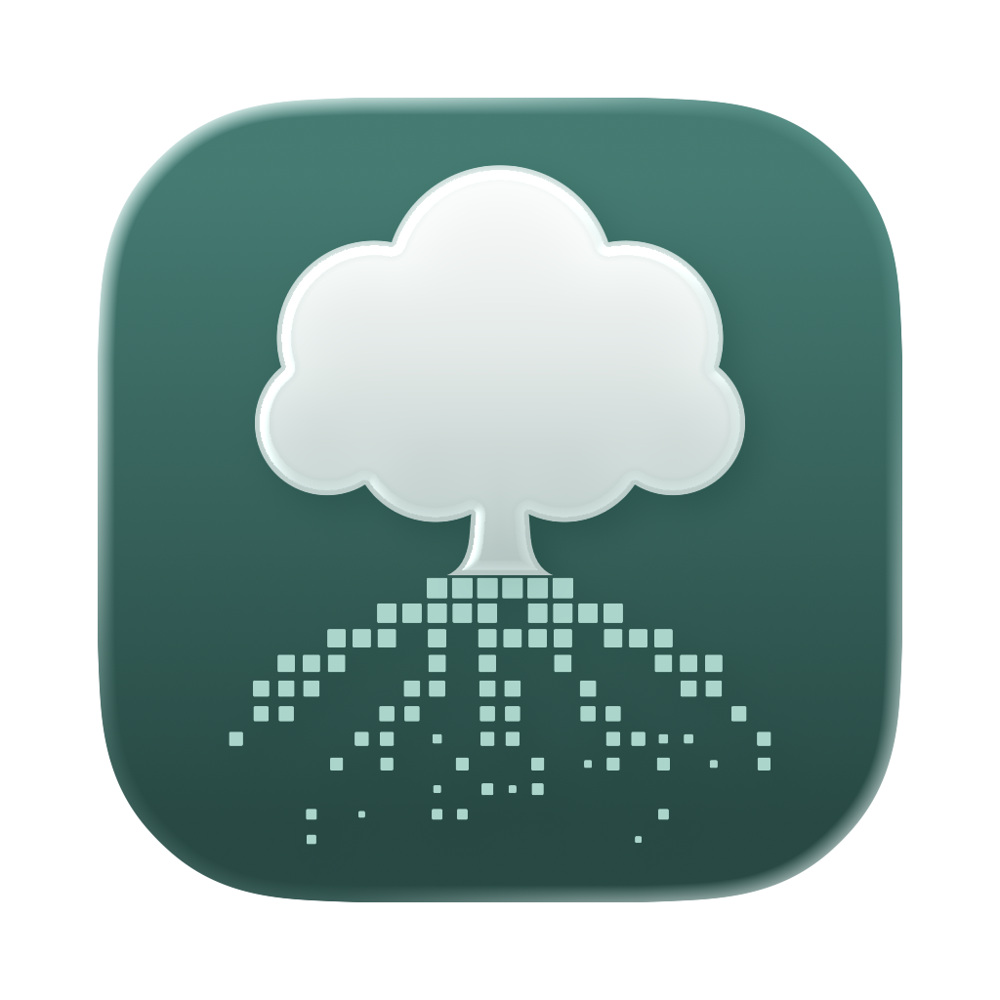
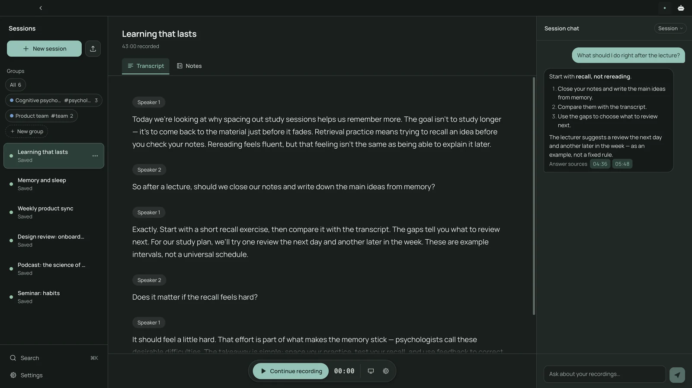
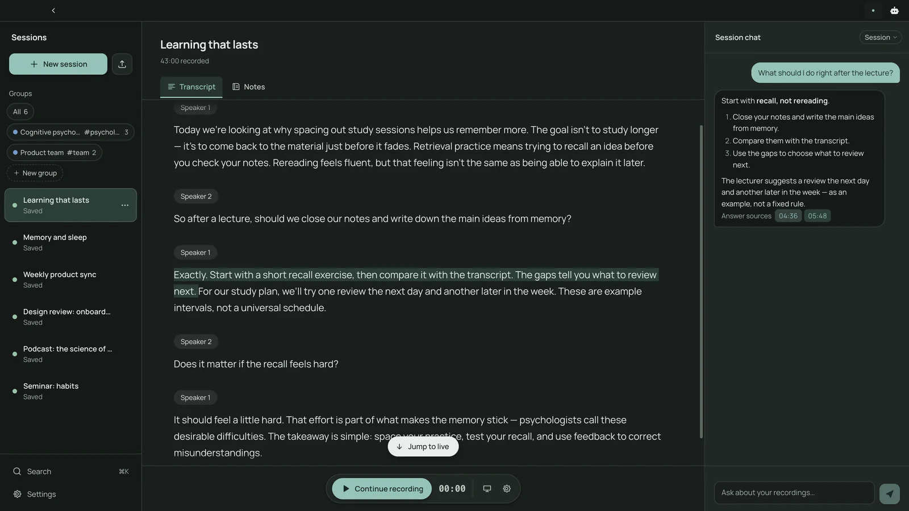
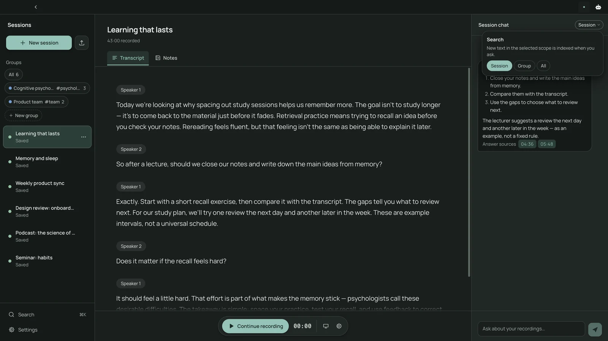
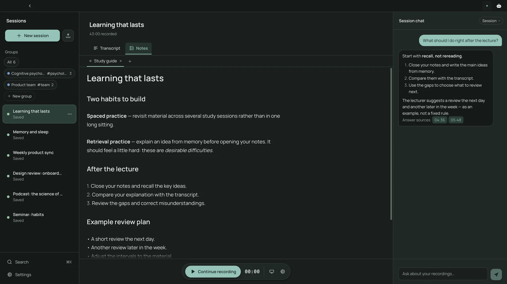
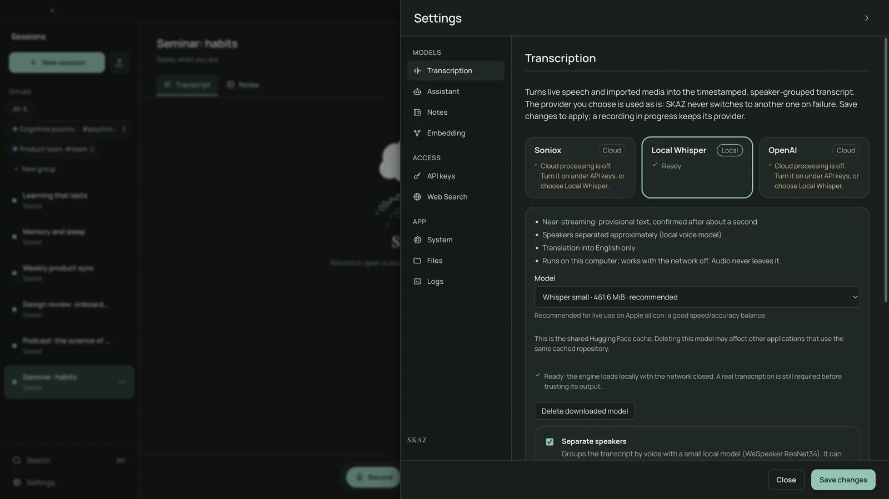
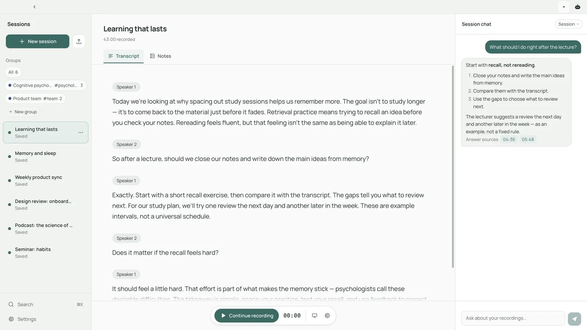

<div align="center">



# SKAZ

**A second pair of ears for lectures and meetings.**

[](https://github.com/all0b0y/SKAZ/releases/latest)


[](LICENSE)

**English** · [Русский](docs/i18n/README.ru.md) · [Español](docs/i18n/README.es.md) · [Deutsch](docs/i18n/README.de.md) · [简体中文](docs/i18n/README.zh-CN.md)

<br>


<sub>Quick tour · demo profile with authored data · <a href="docs/images/skaz-demo.mp4">Full HD video (MP4, 34 s)</a></sub>

</div>

SKAZ is a macOS desktop app that turns speech into a readable transcript,
helps you catch up on what you missed, and keeps questions and notes next to the source.

> **Alpha / early access.** Expect bugs and breaking changes, including changes to
> stored data. Back up important exports. The current target is macOS on Apple Silicon;
> Windows, Linux and Intel Macs are not verified. The interface is currently English-only.

## See it in action

<table>
<tr>
<td width="50%"><br><b>Live transcript</b><br>Speech becomes readable text, grouped by speaker, with the session chat alongside.</td>
<td width="50%"><br><b>Answers with sources</b><br>A source link opens the exact line in the transcript.</td>
</tr>
<tr>
<td width="50%"><br><b>Search scope</b><br>Ask about one session, a group or the whole library.</td>
<td width="50%"><br><b>Editable notes</b><br>Markdown notes in tabs, ready to export.</td>
</tr>
<tr>
<td width="50%"><br><b>Your choice of provider</b><br>Soniox, OpenAI, or Local Whisper running on this Mac.</td>
<td width="50%"><br><b>Light and dark</b><br>Follows your Mac, or pick a theme.</td>
</tr>
</table>

These are captures of the running application, not mockups. Transcripts, answers and notes
are authored demonstration data, not real speech recognition or AI output; the tour above was
assembled from the same captures with [Remotion](https://www.remotion.dev).

## Why SKAZ

Lose the thread for a moment? Ask what you missed instead of searching through a
whole recording. Read the transcript, follow an answer's source links, and turn
useful material into notes you can revisit. AI can make mistakes: source links
help you check an answer; they do not guarantee it is correct.

## Features

- **Live transcription and translation:** choose the speech provider in
  **Settings → Transcription** — Soniox (cloud streaming, full speaker separation,
  translation), **Local Whisper** (faster-whisper on this Mac, works with the network
  off; approximate speakers, translation into English only) or OpenAI. Text is
  grouped by speaker, with access to the original when translating. There is never
  a silent fallback between providers.
- **Microphone and system audio:** select a microphone and optionally include your
  Mac's sound. System-audio capture requires macOS 14.2+ and OS permission.
- **Questions with context:** ask about one session, a group or the whole library
  and follow timestamped references back to the transcript.
- **Notes you can edit:** generate notes, edit Markdown in tabs and export it.
- **A local library:** organize sessions into groups and optionally mirror text
  to a chosen folder for tools such as Obsidian.
- **Media import (experimental):** local audio/video and YouTube import flows.
  Use only material you are authorized to process; availability and formats vary.
- **Separate model choices:** configure Assistant and Notes independently, using
  Codex account sign-in or supported OpenAI, Anthropic and OpenRouter API profiles.
  In **agent mode**, an API model with tool calling reads the library step by step
  through the same bounded SKAZ tools Codex uses, instead of answering from passages
  picked in advance. Live speech uses the transcription provider, not those text models.

## Install and first launch

Download the latest DMG from [GitHub Releases](https://github.com/all0b0y/SKAZ/releases/latest)
(Apple Silicon, macOS 13 or later), open it, drag SKAZ to Applications and launch it.
Alpha builds are not notarized yet: follow the first-launch steps in the release notes
(**Privacy & Security → Open Anyway**). Do not disable macOS security protections globally.
To run the current code instead, use [development setup](CONTRIBUTING.md).

On first launch:

1. Choose the languages you expect to hear.
2. Open **Settings → API keys**, add your Soniox key, enable cloud consent and save —
   or, to keep audio on this Mac, choose **Local Whisper** in **Settings → Transcription**
   and download a model (the size is shown first; no key or cloud consent needed).
3. In **Settings → Transcription**, choose transcription or translation and its target language.
4. Configure **Assistant** and **Notes** separately. For Codex, install the official
   [Codex CLI](https://developers.openai.com/codex/cli/) and sign in through SKAZ's
   Codex settings; SKAZ does not automatically install it. Alternatively, configure
   an API provider key and model. Provider eligibility, limits and charges apply.
5. Create a session, choose audio sources, grant the relevant macOS permissions
   and press **Record**. Pause or stop when needed; open **Notes** to work with the transcript.

Obtain any required consent before recording other people. Soniox and text-model
services have their own pricing; the MIT license does not include their usage.

## Privacy and data

- Transcripts, notes and chats are stored locally. There is no permanent live-audio
  archive for playback; temporary audio may be used for processing or recovery.
- With Soniox or OpenAI, audio goes to that provider for recognition after consent;
  with Local Whisper it is transcribed on this Mac and never sent. Assistant and Notes send
  context to the selected service. Provider retention and training policies apply:
  **local storage does not mean offline processing**.
- API keys are stored in an encrypted local file, with its encryption key alongside
  it. File permissions are the main boundary, not protection from processes running
  as your user. Protect exports and backups too.
- The Python backend is loopback-only and uses a fresh token each launch. See
  [Security](SECURITY.md) for limitations and the current reporting-channel status.

## How it works

```text
Microphone / system audio / media → Electron → Python → Soniox | Local Whisper | OpenAI
                                      ↓         ↓
                                  React UI   Local library
                                                ↕
                                     Assistant / Notes provider
```

| Layer | Stack |
|---|---|
| Desktop | Electron |
| Interface | React, TypeScript, CodeMirror |
| Local backend | Python, FastAPI, SQLite |

## Development and project information

[Contributing](CONTRIBUTING.md) covers setup, tests and PRs. [Packaging](docs/PACKAGING.md)
covers building installers. Release notes will live in [GitHub Releases](https://github.com/all0b0y/SKAZ/releases),
not a separate changelog. Small fixes may go straight to a PR; discuss larger changes first.

Current priorities include release signing/notarization, reliable long-session
recovery and broader real-world validation. Experimental import and web-search
paths are not a promise of production readiness; native Codex web search is currently disabled.

[Community rules](CODE_OF_CONDUCT.md) · [Security policy](SECURITY.md) · [MIT license](LICENSE)

*Skaz* (сказ) is a Russian word for a spoken narrative. The original working name
was SKAZ. Copyright © 2026 all0b0y.
