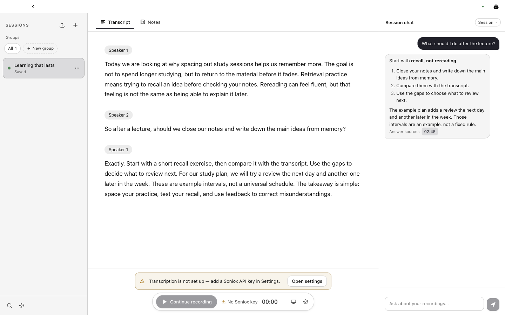
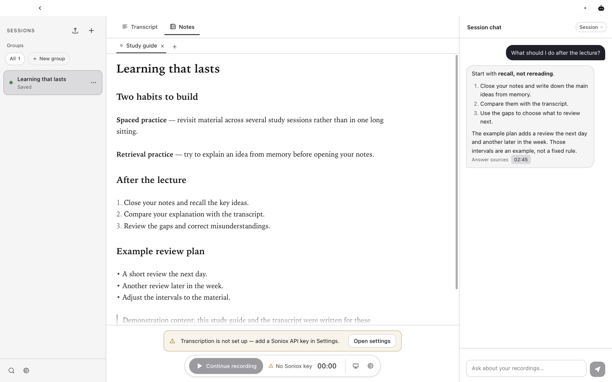

<div align="center">


# SKAZ


[](../../LICENSE)

[English](../../README.md) · **Русский** · [Español](README.es.md) · [Deutsch](README.de.md) · [简体中文](README.zh-CN.md)

</div>

**Вторая пара ушей на лекциях и встречах.**

SKAZ — приложение для macOS, которое превращает речь в читаемую транскрипцию,
помогает восстановить упущенное и держит вопросы и конспекты рядом с источником.

> **Alpha / ранний доступ.** Возможны ошибки и несовместимые изменения, в том числе
> формата данных. Сохраняйте резервные копии важных экспортов. Текущая платформа —
> macOS на Apple Silicon; Windows, Linux и Intel Mac не проверены. Интерфейс пока только на английском.

## Как это выглядит


*Текст сгруппирован по говорящим; рядом — вопрос, ответ и ссылка на источник.*


*Редактируемый Markdown-конспект рядом с чатом сессии.*

Это скриншоты работающего приложения, не макеты. Транскрипция, ответ и конспект
написаны специально для демонстрации — это не результаты распознавания речи или
работы модели. В отдельном демопрофиле нет API-ключей, поэтому виден запрос настройки записи.

## Зачем нужен SKAZ

Потеряли нить разговора? Спросите, что пропустили, вместо переслушивания всей записи.
Читайте транскрипцию, переходите к источникам ответа и сохраняйте полезное в конспекте.
ИИ может ошибаться: ссылки помогают проверить ответ, но не гарантируют его точность.

## Возможности

- **Живая транскрипция и перевод:** распознавание Soniox, группировка по говорящим
  и доступ к оригиналу при переводе.
- **Микрофон и системный звук:** выберите микрофон и при необходимости добавьте звук
  Mac. Для системного звука нужны macOS 14.2+ и разрешение ОС.
- **Вопросы по материалу:** контекст одной сессии или более широкой области библиотеки;
  ссылки с таймкодами возвращают к транскрипции.
- **Редактируемые конспекты:** генерация, вкладки Markdown-редактора и экспорт.
- **Локальная библиотека:** группы сессий и необязательное сохранение текстов в
  выбранную папку для работы, например, в Obsidian.
- **Импорт медиа (экспериментальный):** локальное аудио/видео и YouTube.
  Обрабатывайте только разрешённые вам материалы; доступность и форматы различаются.
- **Независимый выбор моделей:** отдельные настройки Assistant и Notes — вход в
  аккаунт Codex либо API-профили OpenAI, Anthropic и OpenRouter. Живую речь распознаёт Soniox.

## Установка и первый запуск

**Основной канал будущих загрузок — [GitHub Releases](https://github.com/4IPE/SKAZ/releases).**
Опубликованных релизов пока нет, поэтому готовый установщик там недоступен.
Попробовать текущий код можно по [инструкции для разработки](../../CONTRIBUTING.md).

Когда появится DMG для macOS на Apple Silicon, откройте его, перенесите SKAZ в
Applications и запустите приложение. Следуйте примечаниям конкретного релиза:
наличие нотарификации у alpha-сборок не гарантируется. Не отключайте защиту macOS целиком.

При первом запуске:

1. Выберите языки, которые ожидаете услышать.
2. В **Settings → API keys** добавьте ключ Soniox, разрешите облачную обработку и сохраните настройки.
3. В **Settings → Transcription** выберите транскрипцию или перевод и язык перевода.
4. Настройте **Assistant** и **Notes** отдельно. Для Codex установите официальный
   [Codex CLI](https://developers.openai.com/codex/cli/) и войдите через настройки
   Codex в SKAZ; автоматической установки нет. Или выберите API-провайдера, ключ
   и модель. Действуют условия доступа, лимиты и тарифы провайдера.
5. Создайте сессию, выберите источники звука, выдайте необходимые разрешения macOS
   и нажмите **Record**. При необходимости поставьте на паузу или остановите запись;
   для работы с конспектом откройте **Notes**.

Получите необходимое согласие перед записью других людей. Использование Soniox и
текстовых моделей оплачивается по их тарифам и не входит в лицензию MIT.

## Приватность и данные

- Транскрипции, конспекты и чаты хранятся локально. Постоянного архива живого аудио
  для воспроизведения нет; временное аудио может использоваться для обработки и восстановления.
- После согласия аудио передаётся Soniox. Assistant и Notes отправляют контекст
  выбранному сервису. Действуют его правила хранения и обучения:
  **локальное хранение не означает офлайн-обработку**.
- API-ключи хранятся в зашифрованном файле, а ключ шифрования — рядом. Основной барьер —
  права файлов, не защита от процессов вашего пользователя. Защищайте также экспорты и резервные копии.
- Python-бэкенд доступен только через loopback и получает новый токен при запуске.
  Ограничения и состояние канала сообщений об уязвимостях — в [Security](../../SECURITY.md).

## Как это устроено

```text
Микрофон / звук Mac / медиа → Electron → Python → Soniox
                                ↓         ↓
                            React UI   Библиотека
                                          ↕
                               Провайдер Assistant / Notes
```

| Слой | Технологии |
|---|---|
| Приложение | Electron |
| Интерфейс | React, TypeScript, CodeMirror |
| Локальный бэкенд | Python, FastAPI, SQLite |

## Разработка и состояние проекта

Запуск, тесты и PR описаны в [Contributing](../../CONTRIBUTING.md), сборка установщиков —
в [Packaging](../PACKAGING.md). История изменений будет в [GitHub Releases](https://github.com/4IPE/SKAZ/releases),
без отдельного changelog. Небольшие исправления можно присылать сразу; крупные сначала обсуждаем.

Среди приоритетов — подпись и нотарификация релизов, надёжное восстановление длинных
сессий и проверка в реальных условиях. Экспериментальные импорт и веб-поиск не заявлены
готовыми к промышленному использованию; встроенный веб-поиск Codex сейчас отключён.

[Правила общения](../../CODE_OF_CONDUCT.md) · [Безопасность](../../SECURITY.md) · [Лицензия MIT](../../LICENSE)

*Сказ* — устное повествование, рассказ голосом самого рассказчика.
Исходное рабочее название — AudioHelper. Copyright © 2026 all0b0y.
